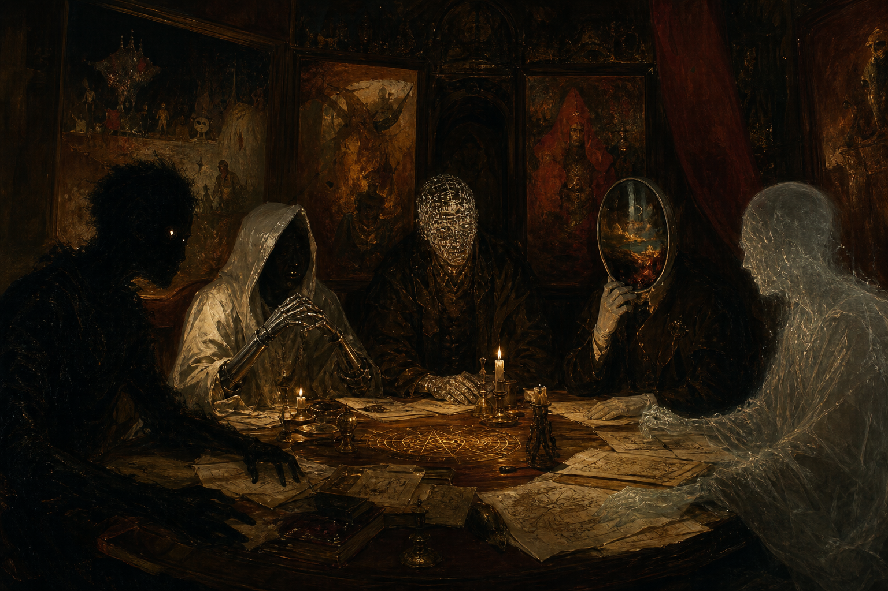

# Hermes Council

<p align="center">
  
</p>

**Multi-agent structured debate for [Hermes Agent](https://github.com/NousResearch/hermes-agent).**

Spawn a panel of custom-composed expert agents to debate any question. Agents are designed specifically for each topic — not generic archetypes — and engage in structured rounds of debate to produce a **decision landscape** that makes every defensible position legible.

## How It Works

A mode-dependent pipeline, built entirely on Hermes oneshot (`hermes -z`) agents:

| Mode | Phases | Agents | Calls | Use Case |
|------|--------|--------|-------|----------|
| `premortem` | Premortem only | 3–5 | ~4 | Rapid failure catalog, "what could go wrong?" |
| `quick` | Premortem → Position → Probe | 3 | 9 | Low-stakes checks |
| `medium` (default) | Premortem → Position → Probe → Reflect | 5 | 16 | Standard decisions |
| `deep` | Premortem → Position → Probe → Reflect → Assumption Map | 5–7 | ~20 | High-friction deliberation |
| `hybrid` | Premortem → Position → Probe → Reflect → Ensemble | 5–7 | ~21 | Council for decomposition, ensemble for estimation |

| Phase | What Happens |
|-------|-------------|
| **Compose** | A subagent analyzes the topic and designs 3–7 expert personas with backgrounds, biases, and analytical approaches tailored to the specific question |
| **Premortem** | Each agent independently writes a history of how the decision *failed* — before any positions are formed. Bypasses positional commitment. |
| **Position** | Each agent forms an independent initial position — parallel oneshot calls |
| **Cross-examine (Probe)** | Each agent reads all other positions and **probes for reasoning** — research shows this is the strongest predictor of group performance gain (R=0.41) |
| **Cross-examine (Reflect)** | Each agent reflects on what they heard — concessions, remaining disagreements, what would close each gap |
| **Assumption Map** (deep) | Each agent maps the assumptions underlying opposing positions. **Not convergence** — produces a divergence map. |
| **Ensemble** (hybrid) | Each agent independently estimates key dimensions (confidence, risk, success likelihood) — no cross-agent contamination. Aggregated by median. |
| **Synthesize** | Main agent produces a **decision landscape**: confidence dispersion report, shared concerns, genuine disagreement, assumptions per position, evidence gaps, risk vectors, principal's path. No forced consensus — the tension IS the output. |

## Zero New Infrastructure

No Hermes source code changes. No plugins. No MCP servers. Pure `SKILL.md` + `hermes -z` oneshot agents.

```bash
# In any Hermes session:
/council "Should we migrate from SQLite to Postgres?"          # medium mode (default)
/council quick "Is this a good time to refactor?"              # 3 agents, fast check
/council deep "What architecture should we choose?"            # 5-7 agents, full protocol
/council hybrid "Estimate the migration risk"                  # council + independent ensemble
/council premortem "What could go wrong with this approach?"   # rapid failure catalog only
```

You can also pass full session context so the council debates with full background:

```bash
cat > /tmp/council-ctx.txt << 'EOF'
# Paste recent conversation history, constraints, decisions already made
EOF
# Then run with --full-context:
python3 ~/.hermes/skills/thinking/council/scripts/orchestrate.py full \
  --mode hybrid \
  --question "Should we migrate to Postgres, given that..." \
  --full-context /tmp/council-ctx.txt
```

## Confidence Dispersion Diagnostic

Every council synthesis includes a **confidence dispersion report** — a per-agent table of pre-debate vs post-debate confidence, mean, dispersion, and a diagnostic:

- **Mean confidence DROPPED + dispersion WIDENED** → council surfaced genuine doubt. ✓ Healthy.
- **Mean confidence ROSE + dispersion NARROWED** → possible false convergence / groupthink. Red flag.

This tells you whether the council did its job, independent of the qualitative content.

## Research-Backed Design

The council protocol is grounded in behavioral economics, organizational psychology, and collective intelligence research:

| Finding | Source |
|---------|--------|
| Probing for reasoning (R=0.41) is the strongest predictor of group performance gain | Karadzhov et al. (2024), 500 Wason task dialogues |
| Diversity of initial position matters more than expertise per member | Karadzhov et al. — diversity p=0.001, presence of correct answer p=0.079 |
| Cognitive diversity has an inverted-U effect — too little causes groupthink, too much causes coordination failure | ScienceDirect (2025), organizational psychology |
| Task conflict improves decisions; relationship conflict destroys them | NeuroLeadership Institute, constructive conflict research |
| Forced convergence produces false consensus — agents agree on conclusions they don't believe | Inverted-U research, Nesta collective intelligence review |
| Independent ensemble averaging beats deliberative panels by ~15-25% on probability estimation | Vasudevan (conceded by all agents in the council's own meta-debate) |

## Effort Levels

| Mode | Agents | Phases | Subagent Calls | Use Case |
|------|--------|--------|----------------|----------|
| `premortem` | 3–5 | P0 (premortem only) | ~4 | Rapid failure catalog |
| `quick` | 3 | P0 → P1 → P2a | 9 | Low-stakes checks |
| `medium` (default) | **5** | P0 → P1 → P2a → P2b | 16 | Standard decisions |
| `deep` | **5–7** | P0 → P1 → P2a → P2b → Assumption Map | ~20 | High-friction deliberation |
| `hybrid` | **5–7** | P0 → P1 → P2a → P2b → Ensemble | ~21 | Council + independent estimates |

## Inference

Council sub-agents resolve their provider and model in this priority:

1. **`auxiliary.council`** — add a `council` entry under `auxiliary:` in `~/.hermes/config.yaml`
2. **`delegation` section** — standard Hermes sub-agent delegation config
3. **`model` section** — your main agent's provider and model

```yaml
# ~/.hermes/config.yaml
auxiliary:
  council:
    provider: opencode-go
    model: deepseek-v4-flash
```

If none are configured, council agents inherit your main session's settings.

## Composition Philosophy

**Never use generic agent types.** Every council member is composed for the specific topic — for example, a database migration debate might include:

- An ex-Uber SRE who was burned by a failed migration
- A YC founder who ran 50K tables on SQLite for 3 years
- A Postgres committer who values correctness
- A startup CTO who regrets their last migration

They are designed to create productive friction — real disagreement grounded in real experience, not caricatures.

## Repository Structure

```
hermes-council/
├── skills/
│   └── council/
│       ├── SKILL.md                    # Workflow definition
│       ├── references/
│       │   ├── composition-guide.md    # Worked examples by domain
│       │   ├── debate-protocol.md      # Round structure & JSON schemas
│       │   └── personas/               # Example persona templates
│       └── scripts/
│           └── orchestrate.py          # Optional lifecycle manager
├── README.md
└── LICENSE
```

## Installation

Clone into your Hermes skills directory:

```bash
git clone https://github.com/magnus919/hermes-council.git
ln -s $(pwd)/hermes-council/skills/council ~/.hermes/skills/thinking/council
```

Then `/council \"question\"` in any Hermes session. Run `hermes reload-skills` if the skill doesn't appear immediately.

## License

MIT

## Inspiration

This project was inspired by **PAII** (Personal AI Infrastructure) by Daniel Miessler, specifically its [Council skill](https://github.com/danielmiessler/Personal_AI_Infrastructure/tree/main/Packs/Council) — a multi-agent debate system that composes custom expert agents with domain expertise, unique voices, and distinct analytical approaches. The Hermes Council implementation adapts PAII's composition philosophy and adversarial collaboration principles to run natively on Hermes Agent's existing infrastructure (oneshot spawning, skill system) with zero external dependencies.

Additional research influences:
- Karadzhov et al. (2024) — large-scale Wason task dialogue study on group reasoning
- Kahneman, Sibony & Sunstein — *Noise: A Flaw in Human Judgment* (adversarial collaboration)
- Berditchevskaia & Bertoncin — Nesta Collective Intelligence Review (group composition)
- Mercier & Sperber — *The Enigma of Reason* (argumentative theory of reasoning)
